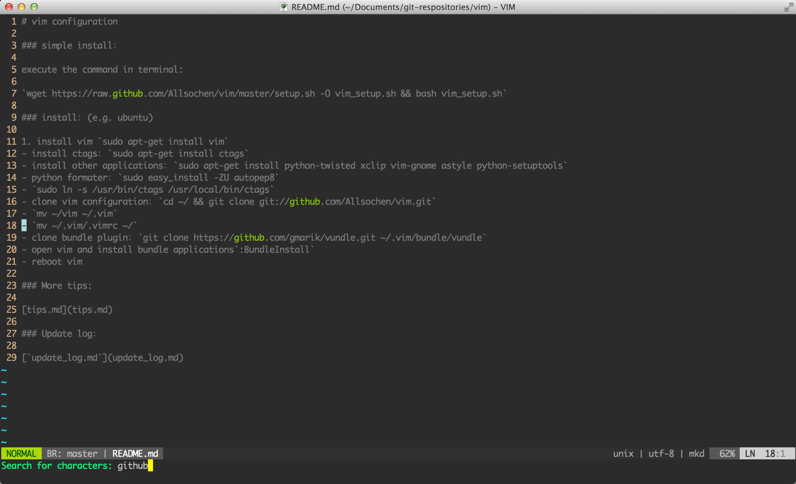

# vim configuration 

### snapshot:

### simple install：

execute the command in terminal:

`wget https://raw.github.com/Allsochen/vim/master/setup.sh -O vim_setup.sh && bash vim_setup.sh`

### install：(e.g. ubuntu)

1. install vim `sudo apt-get install vim`
- install ctags：`sudo apt-get install ctags`
- install other applications：`sudo apt-get install python-twisted xclip vim-gnome astyle python-setuptools`
- python formater：`sudo easy_install -ZU autopep8`
- `sudo ln -s /usr/bin/ctags /usr/local/bin/ctags`
- clone vim configuration：`cd ~/ && git clone git://github.com/Allsochen/vim.git`
- `mv ~/vim ~/.vim`
- `mv ~/.vim/.vimrc ~/`
- clone bundle plugin：`git clone https://github.com/gmarik/vundle.git ~/.vim/bundle/vundle`
- open vim and install bundle applications`:BundleInstall`
- reboot vim

### More tips:

[tips.md](tips.md)

### Update log：

[`update_log.md`](update_log.md)
